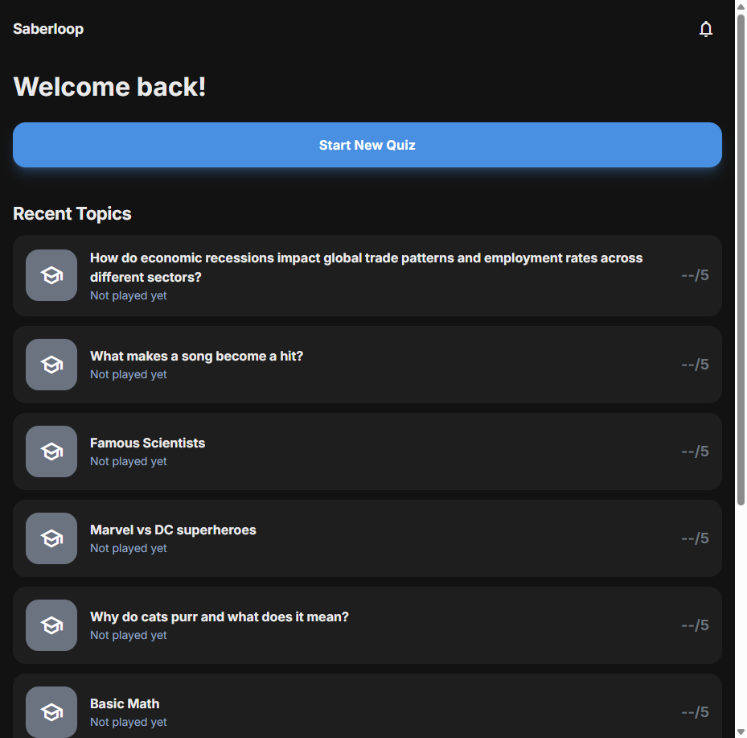

# Issue #13: Incomplete quiz shows date 01/01/1970 (Unix epoch bug)

**Issue URL:** https://github.com/vitorsilva/saberloop/issues/13
**Branch:** `fix/issue-13-epoch-date-bug`
**Date:** 2025-12-18

## Problem Statement

When users haven't completed a quiz, the application displays "01/01/1970" as the completion date instead of showing relevant information. This is caused by improper null/undefined handling when the `timestamp` field is 0 or falsy.

Additionally, as noted in the issue comments, incomplete quizzes were showing "null/5" for the score display in TopicsView.

### Screenshots

**Before Fix (Home):**


**After Fix (Home):**


**After Fix (Topics):**


## Root Cause Analysis

### Code Investigation

1. **Sample data creation** (`src/features/sample-loader.js:36`):
   - Sample quizzes are created with `timestamp: 0` to indicate they haven't been played
   - `score: null` indicates no score yet

2. **Date rendering** (`src/views/HomeView.js:131-132` and `src/views/TopicsView.js:93`):
   ```javascript
   const date = new Date(session.timestamp);
   const dateStr = this.formatDate(date);
   ```
   - When `timestamp` is `0`, `new Date(0)` creates January 1, 1970 (Unix epoch)
   - No validation is performed before creating the Date object

3. **Score display** (`src/views/HomeView.js:110-116`):
   - Already has proper null/undefined handling
   - Shows `--/5` for incomplete quizzes (working correctly)

4. **Score display** (`src/views/TopicsView.js:90-92`):
   - No null/undefined handling for score
   - Shows "null/5" for incomplete quizzes (BUG from issue comments)

## Solution Design

### Approach

Modify both `HomeView.js` and `TopicsView.js` to check for valid timestamps and scores before displaying:
- If `timestamp` is 0 or falsy AND no score exists: show "Not played yet"
- If `timestamp` is valid: show formatted date as usual
- If `score` is null/undefined: show `--/X` instead of `null/X`
- Use gray color for unplayed quizzes

### Changes Required

#### File: `src/views/HomeView.js`

**Location:** Lines 130-132 in `generateRecentTopicsHTML()` method

**New code:**
```javascript
// Format the date - handle unplayed quizzes (timestamp = 0)
let dateStr;
if (!session.timestamp || session.timestamp === 0) {
  dateStr = hasScore ? this.formatDate(new Date(session.timestamp)) : 'Not played yet';
} else {
  dateStr = this.formatDate(new Date(session.timestamp));
}
```

#### File: `src/views/TopicsView.js`

**Location:** Lines 89-102 in `renderQuizItem()` method

**New code:**
```javascript
const hasScore = session.score !== null && session.score !== undefined;
const percentage = hasScore
  ? Math.round((session.score / session.totalQuestions) * 100)
  : null;
const scoreDisplay = hasScore
  ? `${session.score}/${session.totalQuestions}`
  : `--/${session.totalQuestions}`;

// Format the date - handle unplayed quizzes (timestamp = 0)
let dateStr;
if (!session.timestamp || session.timestamp === 0) {
  dateStr = hasScore ? this.formatDate(new Date(session.timestamp)) : 'Not played yet';
} else {
  dateStr = this.formatDate(new Date(session.timestamp));
}

const canReplay = !!session.questions;

// Choose color based on score (gray for unplayed)
let colorClass = 'text-subtext-light bg-gray-500';
if (hasScore) {
  if (percentage >= 80) {
    colorClass = 'text-green-500 bg-green-500';
  } else if (percentage >= 50) {
    colorClass = 'text-orange-500 bg-orange-500';
  } else {
    colorClass = 'text-red-500 bg-red-500';
  }
}
```

### Edge Cases Considered

| Scenario | timestamp | score | Expected Display |
|----------|-----------|-------|------------------|
| Sample quiz (never played) | 0 | null | "Not played yet", "--/5", gray |
| Sample quiz (played once) | Date.now() | 3 | "Today" / date, "3/5", colored |
| New quiz (just completed) | Date.now() | 4 | "Today" / date, "4/5", colored |
| Old quiz (completed before) | past date | 2 | "X days ago" / date, "2/5", colored |

## Testing Plan

### Manual Testing
1. Open app and verify sample quizzes show "Not played yet"
2. Navigate to Topics and verify same behavior
3. Play a sample quiz and verify it shows "Today" after completion
4. Verify real quizzes created by users show correct dates

### Automated Testing

**E2E Test Consideration:**
- Existing E2E tests should continue to pass
- New E2E test could verify "Not played yet" text appears for sample quizzes

**Justification for manual-only new functionality testing:**
- The fix is a simple conditional display change
- E2E tests already cover the home page and topics page rendering
- Adding a specific test for "Not played yet" text would require:
  1. Resetting IndexedDB to a clean state
  2. Loading sample data
  3. Verifying text before any quiz is played
- This is brittle because sample data state varies based on user interaction
- Manual verification is sufficient for this display-only change

## Implementation Steps

1. [x] Create feature branch `fix/issue-13-epoch-date-bug`
2. [x] Capture "before" screenshot
3. [x] Document the plan (this file)
4. [x] Implement the fix in `HomeView.js`
5. [x] Implement the fix in `TopicsView.js` (from issue comments)
6. [x] Capture "after" screenshots (Home and Topics)
7. [ ] Run E2E tests to ensure no regression
8. [ ] Commit and push
9. [ ] Create PR with before/after screenshots

## Files Changed

- `src/views/HomeView.js` - Date display logic fix
- `src/views/TopicsView.js` - Date and score display logic fix
- `docs/issues/13.md` - This documentation
- `docs/issues/13-before.png` - Before screenshot (Home)
- `docs/issues/13-after.png` - After screenshot (Home)
- `docs/issues/13-topics-after.png` - After screenshot (Topics)
