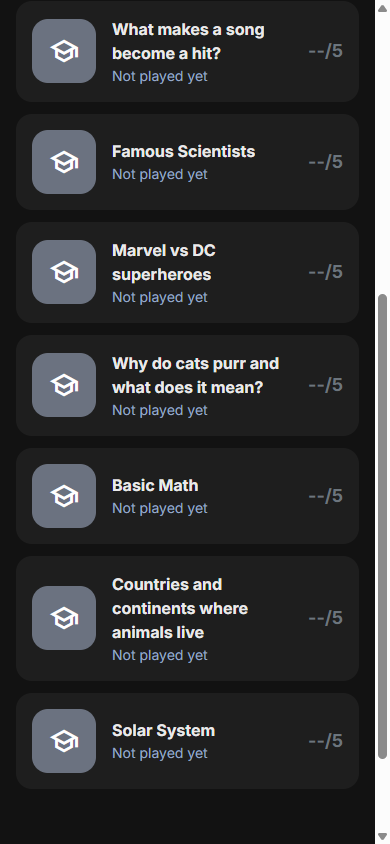
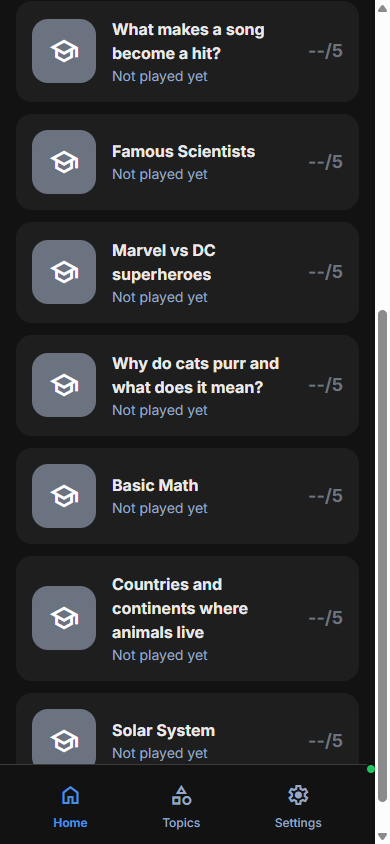

# Issue #16: Bottom navigation should be always visible on all pages

**Issue URL:** https://github.com/vitorsilva/saberloop/issues/16
**Status:** Complete
**Branch:** `fix/issue-16-sticky-nav`

---

## Problem Statement

The bottom navigation bar disappears when users scroll down on certain pages, creating an inconsistent user experience:

| Page | Current State | Expected State |
|------|---------------|----------------|
| Home | Scrolls away with content | Always visible |
| Settings | Scrolls away with content | Always visible |
| Topics | Always visible | Always visible |

---

## Root Cause Analysis

The issue was with CSS `position: sticky` not working reliably across all views due to varying parent container structures. While some views used `h-screen` (fixed viewport height), others used `min-h-screen` (minimum height) with `h-auto`, causing the sticky positioning to fail when content extended beyond the viewport.

**Key insight:** `sticky` positioning only works within a scrolling ancestor container. When the entire page scrolls (body scrolling), sticky elements inside flex containers with `min-h-screen` don't behave as expected.

---

## Solution

Changed the bottom navigation from `position: sticky` to `position: fixed` across all views. This ensures the navigation always stays at the bottom of the viewport regardless of scroll position or parent container structure.

### Changes Made

| File | Change |
|------|--------|
| `src/views/HomeView.js` | Removed `h-auto`, changed `sticky` to `fixed` |
| `src/views/SettingsView.js` | Removed `h-auto`, changed `sticky` to `fixed` |
| `src/views/TopicsView.js` | Changed `sticky` to `fixed` (for consistency) |
| `src/views/TopicInputView.js` | Changed `sticky` to `fixed` |
| `src/views/QuizView.js` | Changed `sticky` to `fixed` |

### Why `fixed` instead of `sticky`?

- **`fixed`**: Always positioned relative to the viewport, stays in place regardless of scroll
- **`sticky`**: Positioned relative to nearest scrolling ancestor, behavior varies based on container structure

Using `fixed` is more reliable and provides consistent behavior across all page layouts.

---

## Testing

### Automated
- [x] All 26 E2E tests pass

### Manual Verification
- [x] Home page: Scroll down, nav stays visible
- [x] Settings page: Scroll down, nav stays visible
- [x] Topics page: Scroll down, nav stays visible
- [x] Quiz page: Nav stays visible during quiz
- [x] All navs highlight correct active page

---

## Before/After Screenshots

### Before (Home page scrolled - nav hidden)

### After (Home page scrolled - nav visible)

---

## Implementation Log

- [x] Created branch `fix/issue-16-sticky-nav`
- [x] Created plan document
- [x] Captured before screenshots
- [x] Implemented fix (changed `sticky` to `fixed` in 5 views)
- [x] Ran E2E tests (26/26 pass)
- [x] Captured after screenshots
- [ ] Created PR
