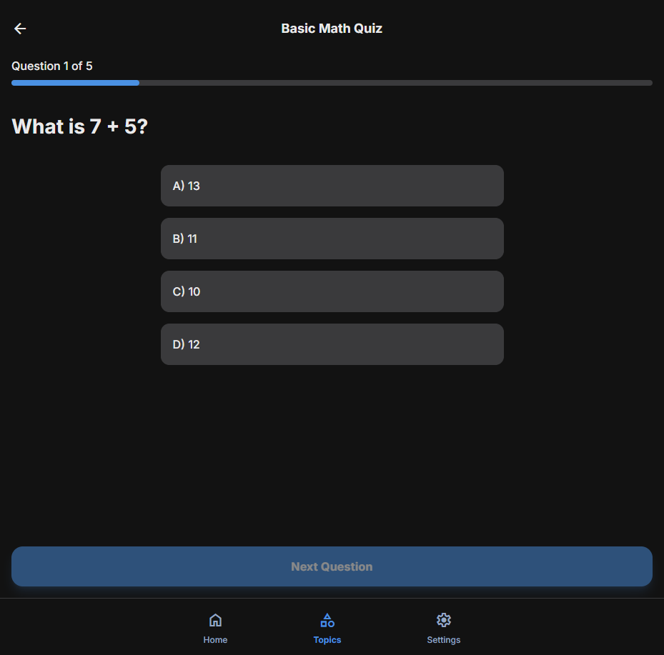

# Issue #79: Answer labels (A, B, C, D) display out of order after shuffle

## Problem Statement

When replaying a quiz, the answer option labels (A, B, C, D) appear in random order (e.g., C, A, B, D) instead of sequential order. This is confusing for users who expect standard quiz format.

## Root Cause Analysis

The Phase 45 answer randomization feature shuffles options to prevent position memorization on replay. However, the letter prefixes (A, B, C, D) are embedded IN the option text stored in the database:

```javascript
// api.real.js:94 - LLM prompt specifies this format
"options": ["A) option1", "B) option2", "C) option3", "D) option4"]
```

When `shuffleQuestionOptions()` shuffles the options array, it shuffles the entire strings including the embedded prefixes, resulting in jumbled labels.

**Code flow:**
1. LLM generates options with embedded prefixes → stored in IndexedDB
2. User replays quiz → `QuizView.js:40-42` calls `shuffleAllQuestions()`
3. `shuffle.js:49` reorders options → prefixes get shuffled too
4. UI renders options in shuffled order with wrong labels

---

## Mockup / Expected Behavior

**Before (bug):**
```
C) Uma vibração súbita da crosta terrestre
A) Uma erupção violenta de um vulcão
B) Uma alteração brusca na temperatura atmosférica
D) Uma mudança nas correntes oceânicas
```

**After (fix):**
```
A) Uma vibração súbita da crosta terrestre
B) Uma erupção violenta de um vulcão
C) Uma alteração brusca na temperatura atmosférica
D) Uma mudança nas correntes oceânicas
```

The answers are still shuffled (different from original order), but labels always appear sequentially A, B, C, D.

---

## Solution Design

**Chosen approach:** Fix in shuffle function

Modify `shuffleQuestionOptions()` to:
1. Strip existing letter prefixes (A-D with parenthesis/dot) before shuffling
2. Shuffle the clean answer text
3. Re-add sequential A), B), C), D) prefixes after shuffling

This approach:
- Handles existing data in IndexedDB (backward compatible)
- Handles new quizzes with embedded prefixes
- Single point of change
- No UI modifications needed

---

## Files to Change

| File | Change Type | Description |
|------|-------------|-------------|
| `src/utils/shuffle.js` | Modify | Add prefix stripping and re-adding logic with JSDoc |
| `src/utils/shuffle.test.js` | Modify | Add comprehensive tests for prefix handling |

---

## Implementation Plan

### Step 1: Add prefix handling utilities to shuffle.js

```javascript
/**
 * Standard answer option labels
 * @type {readonly string[]}
 */
const OPTION_LABELS = ['A', 'B', 'C', 'D'];

/**
 * Regex pattern to match answer option prefixes
 * Handles: "A) text", "A. text", "a) text", "a. text", "A text" (with space)
 * @type {RegExp}
 */
const PREFIX_PATTERN = /^[A-Da-d][).\s]\s*/;

/**
 * Strip letter prefix from an option string
 * @param {string} option - Option text potentially with prefix
 * @returns {string} - Option text without prefix, trimmed
 */
function stripPrefix(option) {
  if (typeof option !== 'string') return option;
  return option.replace(PREFIX_PATTERN, '').trim();
}

/**
 * Add letter prefix to an option
 * @param {string} option - Clean option text
 * @param {number} index - Position (0-3)
 * @returns {string} - Option with prefix like "A) text"
 */
function addPrefix(option, index) {
  const label = OPTION_LABELS[index] || String.fromCharCode(65 + index);
  return `${label}) ${option}`;
}
```

### Step 2: Modify shuffleQuestionOptions()

Update the function to:
1. Strip prefixes from all options before creating indices
2. Shuffle using existing Fisher-Yates logic
3. Re-add sequential prefixes to shuffled options

### Step 3: Update existing tests and add new ones

See Testing Plan below.

---

## Testing Plan

### Unit Tests (shuffle.test.js)

**New tests to add:**

1. **stripPrefix function:**
   - `should strip "A) " prefix`
   - `should strip "B. " prefix`
   - `should strip "c) " prefix (lowercase)`
   - `should handle option without prefix`
   - `should handle empty string`
   - `should handle non-string input`

2. **addPrefix function:**
   - `should add "A) " prefix for index 0`
   - `should add "D) " prefix for index 3`
   - `should handle index beyond D`

3. **shuffleQuestionOptions with prefixes:**
   - `should normalize labels to A, B, C, D order after shuffle`
   - `should strip existing prefixes before shuffling`
   - `should preserve answer text content after prefix normalization`
   - `should correctly track correct answer after prefix normalization`

**Update existing tests:**
- Update `sampleQuestion` to use prefixed options (already done)
- Verify tests still pass with new behavior (labels will now always be A, B, C, D)

### E2E Tests

**New test:** `tests/e2e/quiz-replay-labels.spec.js`

```javascript
test('replay quiz should show options with sequential A, B, C, D labels', async ({ page }) => {
  // 1. Complete a quiz
  // 2. Go to history/topics
  // 3. Replay the quiz
  // 4. Verify first option starts with "A)"
  // 5. Verify second option starts with "B)"
  // 6. etc.
});
```

### Test Coverage Target

- New helper functions (`stripPrefix`, `addPrefix`): 100% coverage
- Modified `shuffleQuestionOptions`: maintain existing coverage
- Run: `npm run test:coverage` - verify no regression

### Mutation Testing

`shuffle.js` is already in `stryker.config.json` mutate list (line 9).

Run after implementation:
```bash
npx stryker run --mutate "src/utils/shuffle.js"
```

Target: Mutation score >= 80% (current threshold)

---

## Architecture Testing

**Verification:** Run `npm run arch` to ensure:
- No new circular dependencies
- `shuffle.js` (utils layer) doesn't import from forbidden layers
- New code follows existing patterns

**Expected result:** No new violations (shuffle.js only exports pure functions, no imports from other app layers).

---

## i18n Considerations

**Not applicable for this fix.**

The labels A, B, C, D are universal and language-independent. They are not user-facing text that needs translation - they're standard multiple-choice notation used globally.

---

## JSDoc Requirements

All new/modified functions must have complete JSDoc:

```javascript
/**
 * Brief description
 * @param {type} paramName - Description
 * @returns {type} - Description
 * @example
 * // Example usage
 */
```

---

## Branch and Commit Strategy

### Branch
```
fix/issue-79-answer-label-order
```

### Commits (conventional commits format)

1. **`test: add failing test for answer label order after shuffle`**
   - Add unit test that expects A, B, C, D labels after shuffle
   - This test will FAIL initially (proves the bug)

2. **`fix: normalize answer labels after shuffle`**
   - Add `stripPrefix()` and `addPrefix()` helper functions
   - Modify `shuffleQuestionOptions()` to use them
   - Failing test now passes

3. **`test: add comprehensive tests for prefix handling`**
   - Add unit tests for edge cases
   - Add E2E test for replay label order

4. **`docs: update issue plan with completion status`**
   - Update this document with results

---

## Learning Notes Strategy

Document progress in: `docs/learning/epic05/PHASE79_LEARNING_NOTES.md`

**Capture:**
- The bug discovery process
- Root cause analysis findings
- Implementation decisions
- Any unexpected issues during fix
- Test results and coverage

---

## Status Update Strategy

### Before Implementation
- [x] Issue created: #79
- [x] Plan document created
- [ ] Plan reviewed and approved by user

### During Implementation
- [ ] Branch created
- [ ] Failing test written and committed
- [ ] Fix implemented and committed
- [ ] All unit tests pass
- [ ] E2E tests pass
- [ ] Mutation testing passes
- [ ] Architecture tests pass

### After Implementation
- [ ] Before/after screenshots captured
- [ ] PR created with summary
- [ ] Learning notes documented
- [ ] Issue plan updated with results

---

## Before State

Screenshot shows labels appearing as C, A, B, D instead of A, B, C, D.

 *(to be captured)*

---

## After State

*(to be captured after fix)*



---

## Checklist

### Preparation
- [x] Root cause identified
- [x] Solution designed
- [ ] Plan reviewed by user

### Implementation
- [ ] Create branch `fix/issue-79-answer-label-order`
- [ ] Write failing test that reproduces the bug
- [ ] Commit failing test
- [ ] Implement the fix with JSDoc
- [ ] Run unit tests - all pass
- [ ] Run E2E tests - all pass
- [ ] Run mutation testing - score >= 80%
- [ ] Run architecture tests - no violations
- [ ] Capture before/after screenshots

### Completion
- [ ] Create PR with summary
- [ ] Document learnings
- [ ] Update this plan with results
