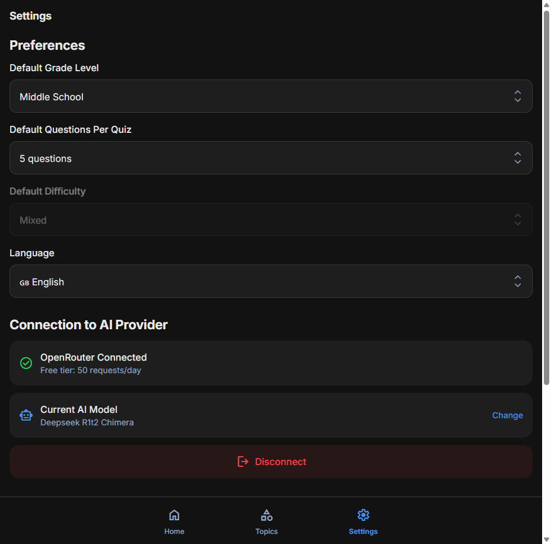
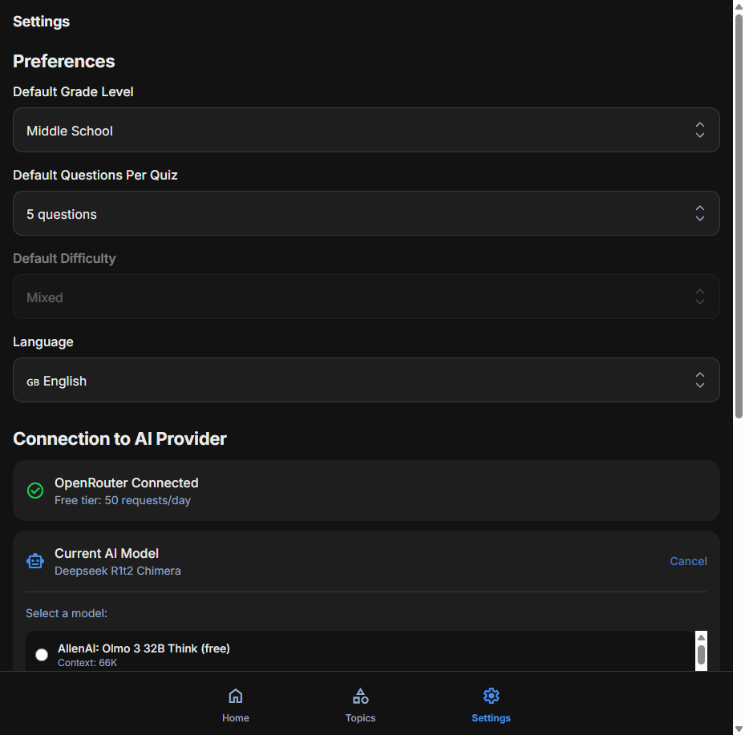

# Phase 47: AI Model Selection

**Status:** ✅ Complete
**Branch:** `feature/phase47-model-selection`
**Completed:** December 27, 2025

## Overview

Enable users to see which AI model is being used and select from available free models on OpenRouter.

**Previous State:**
- Model was hardcoded: `tngtech/deepseek-r1t2-chimera:free`
- Users had no visibility into which model generates their quizzes
- Settings page showed connection status but not model info

**Implementation Result:**
- ✅ Display current model in Settings (under Connection section)
- ✅ Allow users to select from available free models
- ✅ Persist model selection across sessions
- ✅ Pass selected model to API calls
- ✅ Include model in telemetry

## Screenshots

### Settings Page with Model Display


### Model Selector Expanded


---

## Implementation Plan

### 47.1 Add Model Setting to Settings Module

**Files:** `src/core/settings.js`, `src/core/settings.test.js`

**Changes:**
- Add `selectedModel` to `DEFAULT_SETTINGS` with default `'tngtech/deepseek-r1t2-chimera:free'`
- Update unit tests for new default

**Commit:** `feat(settings): add selectedModel setting`

---

### 47.2 Create Model Service

**Files:** `src/services/model-service.js`, `src/services/model-service.test.js`

**Purpose:** Fetch and manage available models from OpenRouter API

**Functions:**
```javascript
// Fetch available free models from OpenRouter
export async function getAvailableModels(apiKey)

// Get user-friendly display name for a model
export function getModelDisplayName(modelId)

// Get the currently selected model
export function getSelectedModel()

// Save user's model selection
export function saveSelectedModel(modelId)
```

**OpenRouter API:** `GET https://openrouter.ai/api/v1/models`
- Returns list of all models with pricing info
- Filter for free models (pricing.prompt === "0" && pricing.completion === "0")
- Cache results to avoid repeated API calls

**Unit Tests:**
- Test model fetching with mocked API response
- Test filtering for free models only
- Test display name extraction
- Test get/save selected model

**Commit:** `feat(services): add model-service for fetching available models`

---

### 47.3 Update OpenRouter Client to Use Selected Model

**Files:** `src/api/openrouter-client.js`, `src/api/openrouter-client.test.js`

**Changes:**
- Import `getSelectedModel` from model-service
- Use selected model as default instead of hardcoded constant
- Keep fallback to hardcoded model if none selected

**Unit Tests:**
- Test that selected model is used in API calls

**Commit:** `feat(api): use selected model from settings`

---

### 47.3b Add Model to Telemetry

**Files:** `src/api/api.real.js`, `src/api/api.real.test.js`

**Current telemetry:**
```javascript
logger.perf('quiz_generation', { value: duration, status: 'success', topic });
```

**Updated telemetry:**
```javascript
logger.perf('quiz_generation', { value: duration, status: 'success', topic, model: result.model });
```

**Changes:**
- Capture `model` from `callOpenRouter` response
- Include `model` in both success and error telemetry events
- This enables analyzing which models are used and their performance

**Unit Tests:**
- Verify model is included in perf logging

**Commit:** `feat(telemetry): include model in quiz_generation metrics`

---

### 47.4 Update Settings View - Display Current Model

**Files:** `src/views/SettingsView.js`

**Changes:**
- When connected, show current model below connection status
- Display model in user-friendly format (e.g., "DeepSeek R1T2 Chimera" instead of full ID)
- Add "Change Model" button that opens model selector

**UI Mockup:**
```
Connection to AI Provider
┌─────────────────────────────────────┐
│ ✓ OpenRouter Connected              │
│   Free tier: 50 requests/day        │
│                                     │
│   Model: DeepSeek R1T2 Chimera      │
│   [Change Model]                    │
└─────────────────────────────────────┘
[Disconnect]
```

**Commit:** `feat(ui): display current model in settings`

---

### 47.5 Create Model Selector Modal/Dropdown

**Files:** `src/views/SettingsView.js` (or new `src/components/ModelSelector.js`)

**Changes:**
- Create model selection UI (modal or expandable section)
- Fetch available models when opened
- Show loading state while fetching
- Display models with friendly names
- Allow selection and save to settings
- Show "Free" badge on free models

**UI Mockup:**
```
Select AI Model
┌─────────────────────────────────────┐
│ ○ DeepSeek R1T2 Chimera      [Free] │
│ ○ Gemma 2 9B                 [Free] │
│ ○ Llama 3.1 8B               [Free] │
│ ○ Mistral 7B                 [Free] │
│ ...                                 │
└─────────────────────────────────────┘
[Cancel]  [Select]
```

**Commit:** `feat(ui): add model selector in settings`

---

### 47.6 Add i18n Translations

**Files:** `public/locales/en/translation.json`, `public/locales/pt-PT/translation.json`

**New Keys:**
```json
{
  "settings": {
    "currentModel": "Model",
    "changeModel": "Change Model",
    "selectModel": "Select AI Model",
    "loadingModels": "Loading available models...",
    "freeModel": "Free",
    "modelChanged": "Model changed successfully"
  }
}
```

**Commit:** `feat(i18n): add model selection translations`

---

### 47.7 Add E2E Tests

**Files:** `tests/e2e/app.spec.js`

**Test Cases:**
1. Display current model when connected
2. Open model selector
3. Select a different model
4. Verify model persists after page refresh
5. Verify model is used in quiz generation (check API call)

**Commit:** `test(e2e): add model selection tests`

---

### 47.8 Update Documentation

**Files:** `CLAUDE.md`, `EPIC4_SABERLOOP_V1_PLAN.md`

**Commit:** `docs: add Phase 47 model selection to plans`

---

## Architecture Considerations

### Data Flow
```
Settings Page
     │
     ▼
Model Selector ──► model-service.js ──► OpenRouter /models API
     │
     ▼
settings.js (localStorage)
     │
     ▼
LoadingView ──► quiz-service.js ──► api.real.js ──► openrouter-client.js
                                                            │
                                                            ▼
                                                   Uses selectedModel
```

### Caching Strategy
- Cache model list for 24 hours (models don't change frequently)
- Store in localStorage with timestamp
- Re-fetch if cache expired or user forces refresh

### Error Handling
- If model fetch fails, show error but allow using default model
- If selected model becomes unavailable, fall back to default
- Log model selection in telemetry for debugging

---

## Testing Requirements

### Unit Tests (target: 100% coverage on new code)
- [x] `settings.test.js` - selectedModel default and persistence
- [x] `model-service.test.js` - All functions tested (18 tests)
- [x] `openrouter-client.test.js` - Selected model usage

### E2E Tests
- [x] Model displayed in settings when connected
- [x] Model selector opens and shows available models
- [x] Model selection persists after page refresh
- [x] Error handling when model loading fails

### Architecture Tests
- [x] `npm run arch:test` passes (no new violations)

---

## Estimated Sessions: 2-3

| Sub-phase | Effort | Description |
|-----------|--------|-------------|
| 47.1 | 15 min | Add setting |
| 47.2 | 45 min | Model service + tests |
| 47.3 | 20 min | Update OpenRouter client |
| 47.3b | 15 min | Add model to telemetry |
| 47.4 | 30 min | Display in settings |
| 47.5 | 45 min | Model selector UI |
| 47.6 | 15 min | Translations |
| 47.7 | 30 min | E2E tests |
| 47.8 | 10 min | Documentation |

---

## Success Criteria

- [x] User can see current model in Settings
- [x] User can change to any available free model
- [x] Model selection persists across sessions
- [x] Quiz generation uses selected model
- [x] All unit tests pass (257 tests, 100% on new code)
- [x] All E2E tests pass (5 new model selection tests)
- [x] Architecture tests pass (67 modules, 164 dependencies)
- [x] No dead code detected

---

## Open Questions

1. **Modal vs Inline Dropdown?**
   - Modal: More space for model info, feels like a "choice"
   - Dropdown: Simpler, consistent with other settings
   - Recommendation: Start with expandable section, iterate based on UX

2. **Show model capabilities?**
   - Could show context length, speed ratings
   - Adds complexity, defer to future enhancement

3. **Allow paid models?**
   - Currently filtering to free only
   - Could add toggle "Show paid models" in future
   - For now, keep it simple with free models only

---

## References

- OpenRouter Models API: https://openrouter.ai/api/v1/models
- OpenRouter Docs: https://openrouter.ai/docs
- Current client: `src/api/openrouter-client.js`
